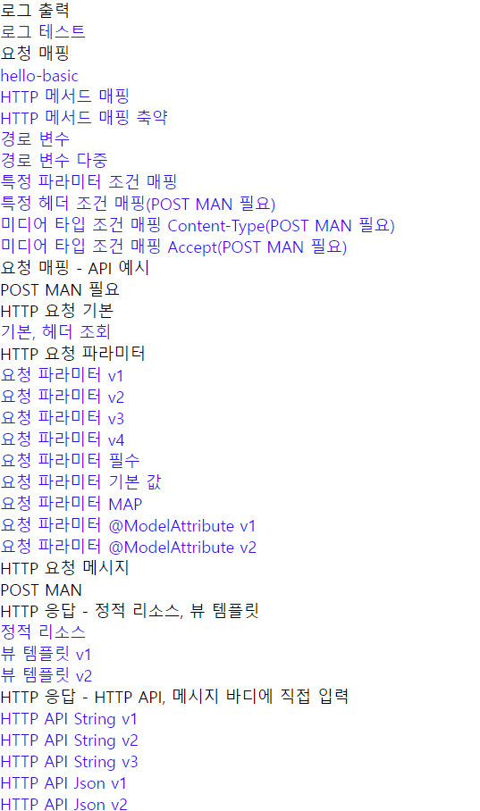

# 스프링 MVC 1편 - 백엔드 웹 개발 핵심 기술

인프런의 ["스프링 MVC 1편 - 백엔드 웹 개발 핵심 기술"](https://www.inflearn.com/course/%EC%8A%A4%ED%94%84%EB%A7%81-mvc-1) 강좌의 학습 자료를 포함하고 있습니다. 

아래 포함된 자료는 로깅, 요청 매핑, HTTP 요청 및 응답, HTTP 메시지 컨버터, 요청 매핑 핸들러 어댑터 구조 등에 대해 다루고 있습니다.

## 포함된 자료

6. **스프링 MVC - 기본 기능**

## 사전 준비물

1. **Java 17 이상** 설치
2. **IntelliJ IDEA** 설치

## 프로젝트 설정

1. **Project**: Gradle - Groovy
2. **Language**: Java
3. **Spring Boot**: 3.3.3
4. **Packaging**: Jar
5. **Java**: 17
6. **Group**: hello
7. **Artifact**: springmvc
8. **Dependencies**: Spring Web, Thymeleaf, Lombok

## 실행 이미지
1. 홈 페이지
- 
